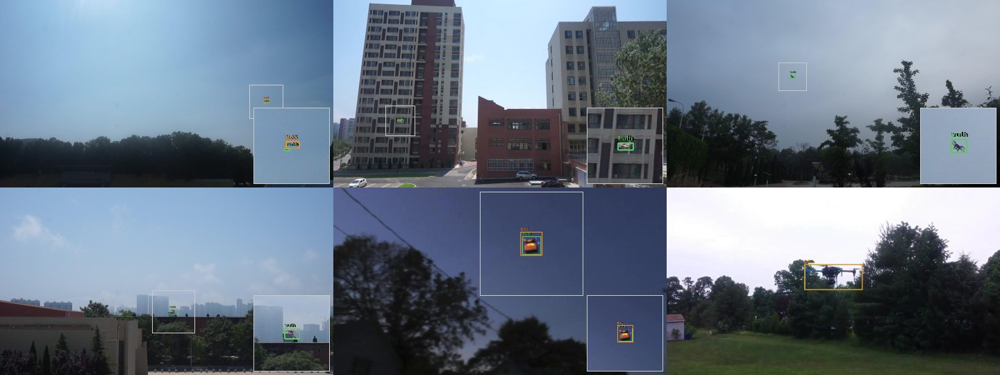

# hailo-uav-tracker

**Real-time UAV detection and pan/tilt tracking on a Raspberry Pi 5 with a 13 TOPS Hailo-8L NPU.**

[](https://github.com/pierrosimonestd-cpu/hailo-uav-tracker/actions/workflows/ci.yml)
[](LICENSE)
[](pyproject.toml)

A camera on a two-axis turret finds a drone in the sky, decides which one to
follow, and keeps it centred while it moves. Detection runs on the NPU; the
tracker and a latency-compensating controller run on the Pi's CPU; an ESP32
drives the servos and holds a failsafe that does not depend on the Pi being
alive.

Accuracy is reported on the public [DUT Anti-UAV](https://github.com/wangdongdut/DUT-Anti-UAV)
benchmark (IEEE T-ITS 2022) under the COCO protocol. Pointing performance is
reported from a closed-loop simulation, clearly labelled as such. Every number
in this repository is produced by a script in `benchmarks/` and written to a
JSON file you can inspect.

---

## What is interesting here

Most edge-vision projects stop at "the model runs at N FPS". The question this
one is built around is different:

> **What does inference latency cost you in degrees of pointing error?**

It turns out that is the *only* question that matters for a tracking turret, and
it has a clean answer. Inference time enters the control loop as dead time. Dead
time caps the achievable loop bandwidth at roughly

$$\omega_c \approx \frac{0.8}{T_d + \tau}$$

which for this hardware is under 1 Hz — while the servos themselves could slew at
600 °/s. **The loop is latency-limited, not actuator-limited.** That is what the
accelerator buys, and it is measurable:

<!-- BEGIN GENERATED: readme-latency -->
| Sense-to-act latency | RMS pointing error |  |
| --- | --- | --- |
| 10 ms | **0.68°** | an accelerator with headroom to spare |
| 45 ms | **0.83°** | the budget `configs/rpi5_hailo8l.yaml` assumes |
| 120 ms | **1.21°** | a pipeline four times slower |
| 300 ms | **2.77°** | a pipeline near the edge of usable |
<!-- END GENERATED: readme-latency -->

Along the way, three things turned out to be more subtle than expected, and each
is written up with the wrong answers included:

- **Velocity feed-forward has two plausible formulations, and both are unstable.**
  Reconstructing the target's absolute rate from "apparent rate plus my own rate"
  is positive feedback with loop gain equal to the feed-forward gain.
  Reconstructing it from the commanded *angle* looks safe but puts a positive
  real pole at `1/τ_servo` into the loop. What works is reconstructing through a
  forward model of the actuator. [Write-up →](docs/control-design.md#5-velocity-feed-forward-and-two-ways-to-get-it-wrong)
- **The aim-time lead is the actuator's lag, not another detection latency.**
  Getting this wrong is invisible: it is correct at one particular frame rate.
  It produced a spurious minimum in the latency curve that looked like a real
  result. [Write-up →](docs/control-design.md#6-aim-time-a-subtle-but-expensive-detail)
- **The obvious serial protocol fails silently and permanently.** Two raw bytes
  per command means one dropped byte swaps pan and tilt for as long as the link
  stays up, and neither end can tell. [Write-up →](docs/hardware.md#why-not-two-raw-bytes)

---

## Results

### Detection — DUT Anti-UAV test split, COCO protocol

<!-- BEGIN GENERATED: detection -->
| Model | Backend | AP | AP50 | AP75 | AP_S | AP_M | AP_L | Images |
| ---: | ---: | ---: | ---: | ---: | ---: | ---: | ---: | ---: |
| `yolov8n-fp32-onnx` | onnx:cpu | 0.556 | 0.894 | 0.585 | 0.418 | 0.578 | 0.717 | 2200 |
| `yolov8n-fp32-pytorch` | ultralytics:cpu | 0.543 | 0.886 | 0.574 | 0.395 | 0.567 | 0.713 | 2200 |
| `yolov8n-int8-onnx` | onnx:cpu | 0.518 | 0.875 | 0.522 | 0.358 | 0.536 | 0.709 | 2200 |
| `yolov8n-negatives` | ultralytics:cpu | 0.503 | 0.865 | 0.514 | 0.356 | 0.559 | 0.657 | 2200 |
<!-- END GENERATED: detection -->

Read `AP_S` first: **52% of the objects in this dataset are smaller than 32×32
pixels**, and the median object covers under one tenth of one percent of the
frame. An aggregate AP can look respectable while the model has stopped seeing
distant targets, which are the ones worth detecting early.

### Latency

<!-- BEGIN GENERATED: latency -->
| Model | Backend | Inference (ms) | End to end (ms) | p95 | p99 | FPS |
| ---: | ---: | ---: | ---: | ---: | ---: | ---: |
| `yolov8n-fp32-onnx` | onnx:cpu | 39.8 | 40.1 | 45.2 | 50.4 | 24.9 |
<!-- END GENERATED: latency -->

### Tracking — DUT Anti-UAV sequences

<!-- BEGIN GENERATED: tracking -->
| Model | Sequences | Frames | Success AUC | Success@0.5 | P@20px | Recall | Re-acquisitions |
| ---: | ---: | ---: | ---: | ---: | ---: | ---: | ---: |
| `yolov8n-fp32-pytorch` | 20 | 24,804 | 0.593 | 0.748 | 0.790 | 0.816 | 193 |
<!-- END GENERATED: tracking -->

Detect-and-track with no ground-truth initialisation, so this is a strictly
harder task than the single-object-tracking baselines published with the
dataset and is not compared against them. *Recall* keeps the rest honest: a
tracker can post a good success curve while answering on a third of the frames.

### Bird discrimination — the weakest result, and what fixing it costs

DUT Anti-UAV contains no birds, so a model trained on it alone has never been
told that a bird is not a drone. Measured against 593 bird photographs from
Open Images V7, with aircraft classes excluded:

<!-- BEGIN GENERATED: hard-negatives -->
| Model | Bird images | Threshold | False-positive rate | Threshold for 1% |
| ---: | ---: | ---: | ---: | ---: |
| `yolov8n-fp32-pytorch` | 593 | 0.35 | 23.44% | 0.9 |
| `yolov8n-negatives` | 593 | 0.35 | 7.08% | 0.7 |
<!-- END GENERATED: hard-negatives -->

**Close to one bird image in four triggers a UAV detection** on the baseline
model, which has never been shown a bird and told it is not a drone. Adding 600
bird photographs to training as background images and fine-tuning for four
epochs takes that to 7%.

That second number means nothing on its own — raising the confidence threshold
suppresses birds too, for free. And the fine-tuned model is *behind* on the
drone benchmark: AP 0.543 to 0.503. The obvious reading is that it just became
timid.

It did not. Compared at matched bird false-positive rates, it finds
substantially more drones at every operating point:

<!-- BEGIN GENERATED: negatives-tradeoff -->
| Target bird FP | Baseline thr / actual | Recall | With negatives thr / actual | Recall | &Delta; |
| ---: | ---: | ---: | ---: | ---: | ---: |
| 10.0% | 0.60 / 9.9% | 0.713 | 0.25 / 9.6% | **0.821** | +15% |
| 6.0% | 0.70 / 5.7% | 0.600 | 0.40 / 5.2% | **0.783** | +31% |
| 3.5% | 0.80 / 2.2% | 0.360 | 0.60 / 2.0% | **0.661** | +83% |
| 2.0% | 0.90 / 0.2% | 0.033 | 0.70 / 0.8% | **0.485** | +1392% &dagger; |

&dagger; the two models' actual bird rates differ by more than 1.5x here, so this row is not a matched comparison and its relative gain is overstated.
<!-- END GENERATED: negatives-tradeoff -->

The baseline needs confidence 0.70 to get birds to 5.7%, and there it has lost
40% of the drones. The fine-tuned model reaches a lower bird rate at 0.40, where
it still sees 78%. Its AP is lower because AP integrates the whole
precision-recall curve including the low-confidence tail no turret operates in —
the right summary for a detector in general, the wrong one for this decision.

Both checkpoints are kept, because which to deploy depends on whether false
alarms or missed drones cost more, and that is not a benchmark question.
[Method, caveats and the disjoint-split check](docs/benchmarks.md#fixing-it-birds-as-training-background).

### Predictions



Six test images spanning the object-size range, smallest first. Green is ground
truth, orange is the model. Where the target is too small to see at this scale
the outlined region is magnified into the corner — which is itself the point:
most of this benchmark looks like the top-left cell, not the bottom-right one.

### Velocity feed-forward — closed-loop simulation

<!-- BEGIN GENERATED: readme-feedforward -->
| Target angular rate | PID only | PID + feed-forward |  |
| ---: | ---: | ---: | ---: |
| 4.7 °/s | 1.02° | **0.34°** | 67% lower |
| 14.1 °/s | 2.89° | **0.83°** | 71% lower |
| 28.3 °/s | 5.48° | **2.86°** | 48% lower |
<!-- END GENERATED: readme-feedforward -->

Full tables, methodology and the reproduction commands: **[docs/benchmarks.md](docs/benchmarks.md)**

---

## Quick start

### On a laptop, no hardware needed

```bash
git clone https://github.com/pierrosimonestd-cpu/hailo-uav-tracker
cd hailo-uav-tracker
pip install -e ".[dev,onnx,bench]"

pytest tests                                    # the whole library, no NPU required
python benchmarks/bench_control.py --study all  # reproduce the pointing tables
uavtrack simulate --trajectory crossing --latency-ms 45
```

### On the Raspberry Pi

```bash
sudo apt install -y hailo-all python3-picamera2
pip install -e .                                # NumPy, OpenCV, PyYAML, pyserial

uavtrack check --config configs/rpi5_hailo8l.yaml
uavtrack run   --config configs/rpi5_hailo8l.yaml --display
```

Full deployment guide, including compiling the model:
**[docs/hailo-deployment.md](docs/hailo-deployment.md)**

### Train your own detector

```bash
python tools/fetch_dut_antiuav.py --out data/dut_antiuav   # 10,000 annotated images
python tools/prepare_dataset.py   --root data/dut_antiuav  # VOC → YOLO + COCO
python tools/train_uav.py --epochs 20 --cache ram
python tools/export_onnx.py --weights runs/train/uav_yolov8n/weights/best.pt
bash tools/compile_hailo.sh models/uav_yolov8n_640.onnx    # needs the Hailo DFC
```

---

## How it works

```
┌────────────┐   BGR frame    ┌──────────────┐   detections   ┌─────────────┐
│  Camera    │───────────────▶│   Detector   │───────────────▶│   Tracker   │
│ Picamera2  │  1280×720@30   │  Hailo-8L    │  boxes+scores  │  ByteTrack  │
└────────────┘                │  YOLOv8n     │                │  + Kalman   │
      ▲                       └──────────────┘                └─────────────┘
      │                                                              │
      │ camera is rigidly mounted on the turret                      │
      │                                                              ▼
┌────────────┐   pan/tilt    ┌──────────────┐   target px    ┌─────────────┐
│  Servos    │◀──────────────│  ESP32       │◀───────────────│  Controller │
│  MG90S ×2  │     PWM       │ framed UART  │  pan/tilt deg  │  PID + FF   │
└────────────┘               └──────────────┘                └─────────────┘
```

| Stage | Runs on | Why |
|---|---|---|
| Detection + NMS | **Hailo-8L NPU** | 13 TOPS; NMS is compiled into the HEF so the CPU never sees raw head tensors |
| Tracking + control | Pi 5 CPU | Microseconds, NumPy only |
| Servo drive + failsafe | ESP32 | Hard-real-time PWM, and a failsafe independent of the Pi |

**Design notes worth reading:** [architecture.md](docs/architecture.md) ·
[control-design.md](docs/control-design.md) · [hardware.md](docs/hardware.md) ·
[dataset.md](docs/dataset.md)

### A few decisions and their reasons

**The Raspberry Pi install has no PyTorch.** Runtime dependencies are NumPy,
OpenCV, PyYAML and pyserial. The YOLO decode path is written in NumPy for this
reason. Training and benchmarking live in optional extras.

**One `Detection` type, three backends.** Hailo, ONNX Runtime and PyTorch all
return identical objects in original-frame pixels. The accuracy benchmark runs
the *same code path* the live pipeline runs, so it measures the system rather
than a benchmark-only wrapper — and the tests run on machines with no NPU.

**Timestamps come from capture, not from a nominal frame rate.** Inference time
on a shared NPU varies; a loop that assumes fixed `dt` accumulates a timing error
the Kalman filter cannot see.

**The failsafe is in the firmware.** If the Pi crashes, Python cannot clean up —
that is what crashing means. The ESP32 cuts the effector and detaches the servos
after 500 ms of silence, and the Pi sends heartbeats so silence is always
deliberate.

**Config typos are fatal.** `conf_treshold: 0.5` raises at startup instead of
being silently ignored.

---

## Repository layout

```
src/uavtrack/      detect/ · track/ · control/ · io/ · data/   the library
firmware/          ESP32 pan/tilt controller, framed protocol
hardware/cad/      printable STL/3MF plus Creo sources
benchmarks/        detection, tracking, latency, hard negatives, control
tools/             dataset fetch/prepare, train, export, quantise, Hailo compile
configs/           Pi + Hailo, and a desktop ONNX config
docs/              architecture, control design, benchmarks, hardware, dataset
tests/             261 tests, plus a C++ conformance test for the firmware
```

## Testing

```bash
pytest tests                       # runs anywhere; no NPU, no PyTorch, no turret
```

261 tests, 86% line coverage. The uncovered remainder is almost entirely the
three device-backed detection backends — Hailo needs an NPU, Ultralytics needs
PyTorch and a checkpoint — which is why everything downstream of them is written
against one `Detection` type that a stub can produce.

Some of those tests exist to keep the documentation honest rather than the code
correct: one re-derives every figure quoted in
[control-design.md](docs/control-design.md) from the measured JSON, another
fails on a broken link or a referenced script that does not exist, and a third
imports the whole library in a subprocess with PyTorch, ONNX Runtime, HailoRT
and SciPy blocked, so the claim about the Raspberry Pi install is enforced
rather than asserted.

CI additionally compiles the **actual firmware header** with a host C++ compiler
and runs the same protocol vectors and adversarial byte streams against it, so
the ESP32 and Python implementations cannot drift apart silently. It also builds
the firmware with `arduino-cli`, and fails if `docs/benchmarks.md` no longer
matches the JSON files in `benchmarks/results/`.

The tests that earn their keep are the ones pinning down specific failures: a
byte dropped on the serial link, a frame missed by the detector, an integrator
charging against a travel limit. Two real bugs found this way are documented in
[control-design.md](docs/control-design.md) §6 and [dataset.md](docs/dataset.md).

## What this does not do

Stated plainly, because a project's honesty is in what it admits rather than
what it claims.

**The on-device numbers are not mine.** The Hailo-8L throughput figures in
[benchmarks.md](docs/benchmarks.md) §5 are Hailo's published Model Zoo results
on COCO, measured on an Intel host, and are attributed as such. The Hailo
backend is written against the HailoRT async API and the compile flow is
scripted end to end, but this repository contains no measurement taken on an
actual Hailo-8L. Run `benchmarks/bench_latency.py` on your own board and the
tables will fill in.

**The pointing results are simulation.** A rate-limited servo model with
transport delay, documented in [`plant.py`](src/uavtrack/control/plant.py). It
does not model backlash, stiction, boresight misalignment or a flexing 3D-printed
yoke — [control-design.md](docs/control-design.md) §9 lists the omissions. It is
how you decide what to take to the hardware, not a substitute for doing so.

**The INT8 study is a proxy.** ONNX Runtime static quantisation shares the
mechanisms that matter with the Hailo quantiser, but it is not that quantiser.

**Bird discrimination is improved, not solved.** The fine-tuned checkpoint still
fires on 7% of bird images, and the training and evaluation negatives are both
Open Images photographs — perched birds, close-ups, birds indoors — not birds in
flight against sky at range, which is the case that matters. The measurement is
a proxy, better than none and not the real thing. Four CPU epochs is also a small
budget for 600 new images; training with them included from the start would
likely beat both checkpoints rather than trading against one.

**The resize-kernel gain does not apply to the shipped configuration.** The
`INTER_AREA` preprocessing is worth about two points of `AP_small` on the
benchmark, but all of that comes from its 1920×1080 images. At the 1280×720 the
Pi config captures, the downscale to 640 is exactly 2:1, where OpenCV's bilinear
filter matches area-averaging to within one intensity level and the gain is
zero. Capturing
at 1080p might recover it; that has not been measured on hardware.
[Details](docs/benchmarks.md#the-resize-kernel-and-a-correctness-proof).

**Monocular, so no range.** Everything is angular. Two targets on the same
bearing at different distances are indistinguishable, which is simply true of
one camera.

**One target at a time.** The tracker follows several; the turret points at one,
chosen with hysteresis and a dwell time. No multi-target scheduling.

**Visible light only.** No thermal channel, so no night capability and a hard
time against a bright overcast sky.

**The servo model is unidentified.** `tau_s` and `delay_s` in
[`plant.py`](src/uavtrack/control/plant.py) are placeholders; the slew rate is
the MG90S datasheet figure. Until you identify your own, keep
`feedforward_gain` at 0.9 rather than 1.0 — the feed-forward is only as good as
that model.

## Credits and licence

MIT, see [LICENSE](LICENSE).

- **DUT Anti-UAV** — Zhao, Zhang, Li, Wang, *Vision-based Anti-UAV Detection and
  Tracking*, IEEE T-ITS 2022. [Dataset](https://github.com/wangdongdut/DUT-Anti-UAV)
- **ByteTrack** — Zhang et al., ECCV 2022,
  [arXiv:2110.06864](https://arxiv.org/abs/2110.06864). The association strategy;
  this is an independent implementation, not a port.
- **Ultralytics YOLOv8** — training and export.
- **Hailo** — HailoRT, the Dataflow Compiler and the published Model Zoo figures
  quoted in [benchmarks.md](docs/benchmarks.md) §4.
- **Open Images V7** — bird images for the hard-negative benchmark.

Hailo throughput figures quoted in this repository are Hailo's own published
COCO measurements on an Intel host, attributed as such, and are not measurements
from this project.
