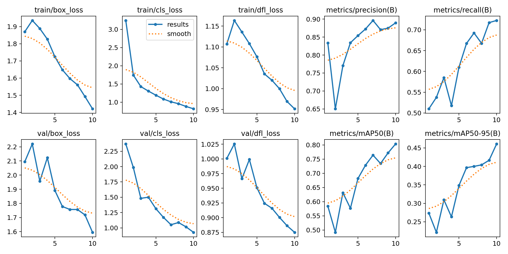
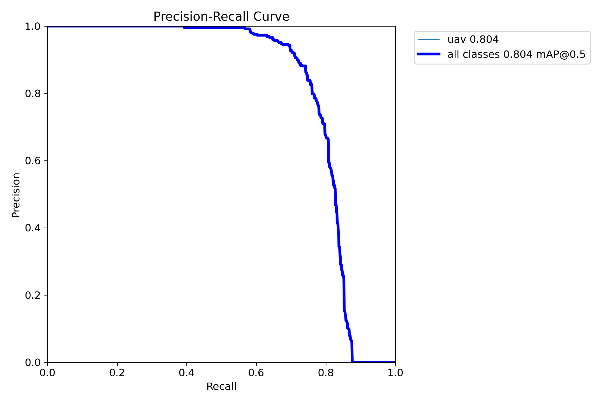

# Benchmarks

Every table below is generated from JSON files in
[`benchmarks/results/`](../benchmarks/results) by
`python benchmarks/make_report.py`. Nothing here is typed in by hand, and every
number traces back to a script you can re-run.

Results are labelled by kind:

- **measured** — produced by running code on real data on the stated hardware.
- **simulation** — produced by the closed-loop model in
  [`simulator.py`](../src/uavtrack/control/simulator.py). Useful for comparing
  configurations, not a substitute for a hardware measurement.
- **published** — figures from a vendor or a paper, cited and attributed.

---

## 1. Detection accuracy — DUT Anti-UAV test split

COCO protocol, 2,200 images, single class, IoU 0.50:0.95. See
[dataset.md](dataset.md) for the benchmark and the evaluation protocol.

```bash
python benchmarks/eval_detection.py \
    --model runs/train/uav_yolov8n/weights/best.pt \
    --tag yolov8n-fp32-pytorch
```

<!-- BEGIN GENERATED: detection -->
| Model | Backend | AP | AP50 | AP75 | AP_S | AP_M | AP_L | Images |
| ---: | ---: | ---: | ---: | ---: | ---: | ---: | ---: | ---: |
| `yolov8n-fp32-onnx` | onnx:cpu | 0.556 | 0.894 | 0.585 | 0.418 | 0.578 | 0.717 | 2200 |
| `yolov8n-fp32-pytorch` | ultralytics:cpu | 0.543 | 0.886 | 0.574 | 0.395 | 0.567 | 0.713 | 2200 |
| `yolov8n-int8-onnx` | onnx:cpu | 0.518 | 0.875 | 0.522 | 0.358 | 0.536 | 0.709 | 2200 |
| `yolov8n-negatives` | ultralytics:cpu | 0.503 | 0.865 | 0.514 | 0.356 | 0.559 | 0.657 | 2200 |
<!-- END GENERATED: detection -->

`AP_S` is the column to read first. Over half the objects in this dataset are
below 32×32 pixels, and an aggregate AP can look respectable while the model has
stopped seeing distant targets — which are the ones worth detecting early.

### The resize kernel, and a correctness proof

The ONNX row above scores *higher* than the PyTorch row it was exported from.
Same weights, so either the decode is wrong or the preprocessing differs.

It is the preprocessing. Ultralytics resizes with bilinear interpolation;
[`preprocess.py`](../src/uavtrack/detect/preprocess.py) uses `cv2.INTER_AREA`
when shrinking. Re-scoring the same graph on the same images with bilinear
forced back on isolates the effect:

```bash
python benchmarks/eval_detection.py     --model models/uav_yolov8n_640.onnx     --downscale linear --tag ablation-inter-linear
```

<!-- BEGIN GENERATED: preprocessing-ablation -->
| Metric | Ultralytics (bilinear) | This decode, bilinear | This decode, `INTER_AREA` | Area &minus; bilinear |
| ---: | ---: | ---: | ---: | ---: |
| `AP` | 0.5427 | 0.5428 | 0.5557 | +0.0130 |
| `AP50` | 0.8858 | 0.8860 | 0.8935 | +0.0075 |
| `AP75` | 0.5738 | 0.5669 | 0.5852 | +0.0182 |
| `AP_small` | 0.3950 | 0.3966 | 0.4185 | +0.0219 |
| `AP_medium` | 0.5674 | 0.5665 | 0.5779 | +0.0113 |
| `AP_large` | 0.7129 | 0.7155 | 0.7175 | +0.0020 |
<!-- END GENERATED: preprocessing-ablation -->

**The decode is correct.** With the kernel matched, this implementation lands
within 0.0001 AP and 0.0002 AP50 of Ultralytics across 2,200 images. The box
decode, the coordinate transform and the NMS here are hand-written NumPy, and
they reproduce the reference to four decimal places. That is the strongest
statement available about a reimplementation: not "it looks right", but "it
scores the same".

#### Where the gain comes from, and where it does not

The aggregate gain is real but it is an average over a benchmark with four
source resolutions, and the kernel does nothing at all for some of them:

```bash
python benchmarks/analyse_resize_ablation.py
```

<!-- BEGIN GENERATED: resize-by-resolution -->
| Source | Downscale | Images | AP `area` | AP `linear` | &Delta; AP | &Delta; AP_S |
| ---: | ---: | ---: | ---: | ---: | ---: | ---: |
| 1920x1080 | 3.00:1 | 1348 | 0.4769 | 0.4540 | +0.0229 | +0.0236 |
| 1280x720 | 2.00:1 | 836 | 0.6721 | 0.6721 | +0.0000 | +0.0000 |
| 960x720 | 1.50:1 | 8 &dagger; | 0.7969 | 0.7969 | +0.0000 | +0.0000 |
| 640x360 | 1.00:1 | 6 &dagger; | 0.5864 | 0.5864 | +0.0000 | +0.0000 |
| 1440x1080 | 2.25:1 | 1 &dagger; | 0.6000 | 0.2500 | +0.3500 | +0.0000 |
| 696x643 | 1.09:1 | 1 &dagger; | 0.6243 | 0.6243 | +0.0000 | +0.0000 |

&dagger; fewer than 50 images; shown for completeness, not interpretable.
<!-- END GENERATED: resize-by-resolution -->

Every point of the improvement comes from the 1920x1080 images. At 1280x720 the
delta is not small, it is **exactly zero** -- because at an exact 2:1 downscale
OpenCV's bilinear filter averages the same 2x2 block that `INTER_AREA` does and
the two kernels produce bit-identical pixels. That is pinned by a test, not
inferred.

The mechanism at 3:1 is not "area-averaging keeps more signal". Averaged over
sub-pixel offsets both kernels pass the *same* total energy. The difference is
variance. Rendering a one-pixel-wide line -- what a distant UAV becomes at
range -- at 24 sub-pixel offsets:

| Kernel | min | max | mean |
|---|---:|---:|---:|
| `INTER_AREA` | 85 | 85 | 85.0 |
| `INTER_LINEAR` | **0** | 255 | 85.0 |

Bilinear at 3:1 samples two columns of every three. The target lands on a
sample and comes through at full intensity, or lands between samples and
disappears completely; it is worse than area-averaging at 16 of 24 offsets. A
detector gains nothing from the offsets where bilinear over-delivers and fails
outright on the ones where the target is gone. Area-averaging trades the peaks
away for a response that does not depend on where the drone happens to sit
within a source pixel. See
[`test_preprocess.py`](../tests/test_preprocess.py).

#### What this means for the deployed configuration

**It does not apply to it.** [`configs/rpi5_hailo8l.yaml`](../configs/rpi5_hailo8l.yaml)
captures at 1280x720, which is exactly 2:1 into a 640 network -- the row where
the measured delta is zero. The honest reading of the ablation is:

- the `INTER_AREA` default is the right default, and costs nothing;
- it is worth roughly two points of `AP_small` **at non-dyadic downscale ratios**;
- at this project's own capture resolution it is a no-op, and quoting the
  aggregate number as a property of the turret would be quoting a true
  measurement to support a false claim.

It also suggests something testable on hardware: capturing at 1920x1080 and
letterboxing 3:1 may detect small targets better than capturing at 720p, for
reasons that have nothing to do with the extra pixels reaching the network.
That has not been measured here, and is listed in
[What this does not do](../README.md#what-this-does-not-do).

### Quantisation, and how it fails

The Hailo-8L is an INT8 accelerator, so the model that runs on the turret is not
the model that was trained. Reporting only FP32 numbers would be reporting a
model this project does not run.

Compiling a HEF needs the Hailo Dataflow Compiler, which requires a developer
account and does not run in CI. Static INT8 quantisation through ONNX Runtime
does run anywhere and shares the mechanisms that matter: affine quantisation,
calibration on a sample of training images, and the same sensitivities. It is a
**proxy** for the Hailo quantiser, not a substitute, and the `-int8-onnx` tags
above say so.

Getting it to work at all took three findings, each reproducible with
`tools/quantize_onnx.py`:

| Recipe | Result |
|---|---|
| Whole graph, per-tensor, MinMax | **zero detections** at any threshold |
| Whole graph, per-channel, opset 11 | fails to load: `INVALID_GRAPH` |
| Whole graph, per-channel, opset 13 | **zero detections** |
| Whole graph, per-channel, percentile calibration | **zero detections** |
| Convolutions only, decode tail left in FP32 | works |

**Why the whole-graph recipes collapse.** The final `Concat` in the YOLOv8 head
joins decoded box coordinates, which span 0 to 640 in pixel units, with class
scores, which span 0 to 1. One quantisation scale has to cover both, and at
uint8 that scale is roughly 2.5 units per level — so every class score rounds to
zero. The model is not degraded, it is silenced, and silenced in a way that
looks exactly like a working pipeline that happens to find nothing.

**Why opset 11 cannot do per-channel.** Opset 11's `QuantizeLinear` has no
`axis` attribute, so the graph is invalid. It surfaces as `INVALID_GRAPH` at
session creation, naming nothing relevant. `tools/export_onnx.py` therefore
exports opset 13, which the Hailo compiler also accepts.

**The fix.** Quantise the convolutions and keep the head's decode tail — 24
cheap element-wise nodes — in floating point. All the compute is in the
convolutions, so the model is still 3.5× smaller. Hailo's compiler runs its own
mixed-precision analysis for the same reason, which is part of why the HEF is
the measurement that ultimately counts.

For scale, Hailo's own published float-to-hardware gap on COCO is 0.6–1.5 mAP
points for the YOLOv8/YOLO11 family (§5).

---

### The training run behind these numbers

```bash
python tools/train_uav.py     --data data/dut_antiuav/dut_antiuav_fastval.yaml     --epochs 10 --imgsz 640 --batch 16 --device cpu     --workers 8 --cache ram --close-mosaic 3
```

YOLOv8n from the COCO-pretrained checkpoint, 10 epochs on the 5,200-image
training split, CPU only, 3 h 52 m wall clock. The exact arguments are written
to `runs/train/uav_yolov8n/train_config.json` next to the weights.



**These curves are not the reported accuracy.** Per-epoch validation runs
against a 400-image subset (`dut_antiuav_fastval.yaml`), because validating on
the full split after every CPU epoch costs more than the epoch does. The subset
is for watching the curve and for checkpoint selection; every number in §1 is
measured on the untouched 2,200-image test split.

Two things in the curve are worth knowing if you re-run this:

- mAP50 oscillates hard for the first five epochs -- 0.58, 0.49, 0.63, 0.58,
  0.68 -- while the classification loss falls monotonically throughout. On a
  400-image subset the metric is noisy enough to look like divergence when
  nothing is wrong. Watch the loss.
- The last three epochs run with mosaic augmentation disabled
  (`--close-mosaic 3`), and the step is visible: 0.772 to 0.804 mAP50 on the
  final epoch.



Ten CPU epochs is a deliberately modest budget -- enough to produce a detector
worth measuring end to end, not enough to be a serious attempt at the benchmark.
A longer schedule on a GPU, and birds as labelled negatives, are the two obvious
improvements.

## 2. Latency and throughput

```bash
python benchmarks/bench_latency.py --model models/uav_yolov8n_640.hef --frames 300
```

<!-- BEGIN GENERATED: latency -->
| Model | Backend | Inference (ms) | End to end (ms) | p95 | p99 | FPS |
| ---: | ---: | ---: | ---: | ---: | ---: | ---: |
| `yolov8n-fp32-onnx` | onnx:cpu | 39.8 | 40.1 | 45.2 | 50.4 | 24.9 |
<!-- END GENERATED: latency -->

Quote the **p95**, not the mean. A control loop is hurt by the tail: one 200 ms
frame in fifty does more damage to a pointing solution than a mean that is 5 ms
worse, because the tracker's extrapolation error grows with the gap and the
controller cannot know a frame is late until it arrives.

`control.latency_s` in your config should be set from the median-to-p95 range
measured on **your** hardware.

Watching the tail is not academic. This benchmark's first run reported a
**1.8-second p99 on the tracking stage** against a 0.6 ms median -- a lazy
`import scipy.optimize` inside the association function, paid on whichever frame
first had both a track and a detection to match. The median hid it completely.
Resolving the import at module load moved the stage p99 to 1.0 ms and the
end-to-end p99 from 1959 ms to 164 ms.

---

## 3. Tracking — DUT Anti-UAV sequences

```bash
python tools/fetch_dut_antiuav.py --out data/dut_antiuav_tracking --splits tracking
python benchmarks/eval_tracking.py --model runs/train/uav_yolov8n/weights/best.pt
```

<!-- BEGIN GENERATED: tracking -->
| Model | Sequences | Frames | Success AUC | Success@0.5 | P@20px | Recall | Re-acquisitions |
| ---: | ---: | ---: | ---: | ---: | ---: | ---: | ---: |
| `yolov8n-fp32-pytorch` | 20 | 24,804 | 0.593 | 0.748 | 0.790 | 0.816 | 193 |
<!-- END GENERATED: tracking -->

**Not comparable to the dataset's SOT baselines.** A single-object tracker is
handed the ground-truth box in frame one and only has to follow it. This
pipeline is never told where the target is — it detects, associates and selects
a primary target with no initialisation. That is a strictly harder task, and the
numbers are reported as what they are.

*Recall* is the column that keeps the others honest: a tracker can post a good
success curve while answering on only a third of the frames. *Re-acquisitions*
counts identity changes on the primary target — each one is a moment where a
real turret would have swung somewhere else.

---

## 4. Bird discrimination

Birds are the canonical false positive for ground-to-air UAV detection: similar
apparent size at range, same sky background, similar motion. DUT Anti-UAV
contains no labelled birds, so this is measured separately on Open Images V7
bird images with aircraft classes excluded.

```bash
python benchmarks/eval_hard_negatives.py --model runs/train/uav_yolov8n/weights/best.pt --fetch
```

<!-- BEGIN GENERATED: hard-negatives -->
| Model | Bird images | Threshold | False-positive rate | Threshold for 1% |
| ---: | ---: | ---: | ---: | ---: |
| `yolov8n-fp32-pytorch` | 593 | 0.35 | 23.44% | 0.9 |
| `yolov8n-negatives` | 593 | 0.35 | 7.08% | 0.7 |
<!-- END GENERATED: hard-negatives -->

The metric is the fraction of bird images that produce at least one UAV
detection at the deployed threshold — that is, how often the turret would swing
onto a pigeon.

### Fixing it: birds as training background

`tools/add_hard_negatives.py` fetches bird photographs and installs them as
background images -- an empty label file, so any detection on them becomes loss.
Four epochs of fine-tuning on top of the existing weights:

```bash
python tools/add_hard_negatives.py --count 600
python tools/train_uav.py --data data/dut_antiuav/dut_antiuav_negatives.yaml     --model runs/train/uav_yolov8n/weights/best.pt --epochs 4 --close-mosaic 2
```

The negatives are drawn from the Open Images **train** split while the benchmark
scores the **validation** split, so the two are disjoint by construction; the
script refuses to run otherwise, and the two image sets were also checked for
overlap by filename. Training on the images you are about to be scored on is an
easy mistake to make and produces a spectacular, meaningless result.

The headline: **the false-positive rate on birds falls from 23.4% to 7.1%** at
the operating threshold. Taken alone that number is worthless, because raising
the confidence threshold achieves the same thing for free. Worse, the fine-tuned
model is *behind* on the drone benchmark -- AP 0.543 to 0.503, AP50 0.886 to
0.865. Read those two facts together and the obvious conclusion is that the
model simply became timid.

It did not, and the way to tell is to compare at **matched bird false-positive
rates**:

```bash
python benchmarks/analyse_negatives_tradeoff.py
```

<!-- BEGIN GENERATED: negatives-tradeoff -->
| Target bird FP | Baseline thr / actual | Recall | With negatives thr / actual | Recall | &Delta; |
| ---: | ---: | ---: | ---: | ---: | ---: |
| 10.0% | 0.60 / 9.9% | 0.713 | 0.25 / 9.6% | **0.821** | +15% |
| 6.0% | 0.70 / 5.7% | 0.600 | 0.40 / 5.2% | **0.783** | +31% |
| 3.5% | 0.80 / 2.2% | 0.360 | 0.60 / 2.0% | **0.661** | +83% |
| 2.0% | 0.90 / 0.2% | 0.033 | 0.70 / 0.8% | **0.485** | +1392% &dagger; |

&dagger; the two models' actual bird rates differ by more than 1.5x here, so this row is not a matched comparison and its relative gain is overstated.
<!-- END GENERATED: negatives-tradeoff -->

At every operating point, with birds suppressed equally hard or harder, the
fine-tuned model finds substantially more drones. The baseline needs a
confidence of 0.70 to get birds down to 5.7%, and at 0.70 it has lost 40% of the
drones; the fine-tuned model reaches a *lower* bird rate at 0.40, where it still
sees 78%.

So why is its AP lower? Because AP integrates the whole precision-recall curve,
including the low-confidence tail no deployment operates in. The fine-tuned
model is worse there and better everywhere a turret would actually be set. AP is
the right summary for a detector in general and the wrong one for this decision.

Two caveats on the result:

- **Four epochs on CPU is a small budget** for absorbing 600 new images, 10% of
  the training set. A full training run with the negatives included from the
  start would very likely beat both models rather than trading against one.
- **Bird photographs are not birds in flight against sky.** Open Images contains
  perched birds, close-ups and birds indoors. The rate measured here is a proxy
  for the deployment case, better than no measurement and not the same thing.

Both models are kept. Which one to deploy depends on whether false alarms or
missed drones cost more, and that is an application question, not a benchmark
one.

---

## 5. Published Hailo-8L throughput

Not measurements from this project. These are **Hailo's published Model Zoo
figures on COCO**, measured on an Intel Core i5-9400 over PCIe Gen 3 ×4 with
Dataflow Compiler v2.19.0 — a different host and a different link from a
Raspberry Pi. Included because they set the expectation for what the accelerator
can do:

| Model | Input | mAP (float) | mAP (hardware) | FPS (batch 1) | FPS (batch 8) |
|---|---|---:|---:|---:|---:|
| yolov8n | 640×640 | 37.0 | 36.4 | 202 | 438 |
| yolov8s | 640×640 | 44.6 | 43.9 | 110 | 208 |
| yolov11n | 640×640 | 39.0 | 37.5 | 157 | 371 |
| yolov11s | 640×640 | 46.3 | 45.1 | 92.0 | 192 |

Source: [Hailo Model Zoo, HAILO8L object detection](https://github.com/hailo-ai/hailo_model_zoo/blob/master/docs/public_models/HAILO8L/HAILO8L_object_detection.rst)

yolov8n at 202 FPS gives the control loop roughly an order of magnitude more
frames than it can use — §6 shows the loop bandwidth is capped near 1 Hz by
latency. The useful question for this system is latency, not frame rate.

---

## 6. Closed-loop pointing — simulation

**These are simulation results.** The servo model — transport delay, first-order
lag, hard slew-rate limit — is documented in
[`plant.py`](../src/uavtrack/control/plant.py), and what it does *not* model
(backlash, stiction, boresight misalignment, structural flex) is listed in
[control-design.md](control-design.md) §9.

```bash
python benchmarks/bench_control.py --study all
```

### 6.1 Pointing error against sense-to-act latency

Target orbiting at 14 °/s; mean of five seeds; steady state after 2 s.

<!-- BEGIN GENERATED: control-latency -->
| Sense-to-act latency | RMS error | Peak error | In frame |
| ---: | ---: | ---: | ---: |
| 10 ms | 0.68° | 1.03° | 100% |
| 20 ms | 0.69° | 1.05° | 100% |
| 30 ms | 0.73° | 1.14° | 100% |
| 45 ms | 0.83° | 1.21° | 100% |
| 60 ms | 0.87° | 1.24° | 100% |
| 80 ms | 1.01° | 1.40° | 100% |
| 120 ms | 1.21° | 1.63° | 100% |
| 160 ms | 1.45° | 1.93° | 100% |
| 200 ms | 1.83° | 2.37° | 100% |
| 300 ms | 2.77° | 4.48° | 100% |
<!-- END GENERATED: control-latency -->

This is the table that justifies the accelerator. Inference time enters the
control loop as dead time, dead time caps the achievable loop bandwidth, and
bandwidth is what keeps a manoeuvring target centred.

### 6.2 Velocity feed-forward

<!-- BEGIN GENERATED: control-feedforward -->
| Peak target rate | Feed-forward off | Feed-forward on | Reduction |
| ---: | ---: | ---: | ---: |
| 4.7 °/s | 1.02° | 0.34° | 67% |
| 9.4 °/s | 1.93° | 0.41° | 79% |
| 14.1 °/s | 2.89° | 0.83° | 71% |
| 18.9 °/s | 3.81° | 1.36° | 64% |
| 28.3 °/s | 5.48° | 2.86° | 48% |
<!-- END GENERATED: control-feedforward -->

A rate-commanded loop has a steady velocity-lag error of `target_rate / kp`.
Feed-forward cancels it open-loop, removing roughly two thirds of the pointing
error on a moving target. Getting the reconstruction right is subtle — two
plausible approaches are unstable, and
[control-design.md](control-design.md) §5 works through why.

### 6.3 Robustness to missed detections

<!-- BEGIN GENERATED: control-dropout -->
| Detections missed | RMS error | In frame |
| ---: | ---: | ---: |
| 0% | 0.83° | 100% |
| 10% | 0.84° | 100% |
| 20% | 0.84° | 100% |
| 30% | 0.85° | 100% |
| 50% | 1.07° | 100% |
| 70% | 48.09° | 78% |
<!-- END GENERATED: control-dropout -->

Flat to 50% loss, then a cliff as gaps start exceeding the tracker's coasting
budget. Past that point the answer is a better detector, not a longer `max_age`.

---

## Reproducing everything

Everything below, in order, is also available as one command:

```bash
python benchmarks/run_all.py --weights runs/train/uav_yolov8n/weights/best.pt
```

It skips any benchmark whose inputs are missing -- no Hailo device, no tracking
subset, no checkpoint -- rather than failing, and regenerates the tables at the
end. The individual scripts remain the interface:

```bash
pip install -e ".[train,onnx,bench]"

python tools/fetch_dut_antiuav.py --out data/dut_antiuav
python tools/prepare_dataset.py   --root data/dut_antiuav
python tools/train_uav.py --data data/dut_antiuav/dut_antiuav.yaml --epochs 20
python tools/export_onnx.py   --weights runs/train/uav_yolov8n/weights/best.pt
python tools/quantize_onnx.py --model models/uav_yolov8n_640.onnx

python benchmarks/eval_detection.py --model runs/train/uav_yolov8n/weights/best.pt --tag yolov8n-fp32-pytorch
python benchmarks/eval_detection.py --model models/uav_yolov8n_640.onnx      --tag yolov8n-fp32-onnx
python benchmarks/eval_detection.py --model models/uav_yolov8n_640.int8.onnx --tag yolov8n-int8-onnx
python benchmarks/bench_latency.py  --model models/uav_yolov8n_640.onnx      --tag yolov8n-fp32-onnx
python benchmarks/eval_hard_negatives.py --model runs/train/uav_yolov8n/weights/best.pt --fetch
python benchmarks/eval_tracking.py --model runs/train/uav_yolov8n/weights/best.pt
python benchmarks/bench_control.py --study all

python benchmarks/make_report.py
```

Host details are recorded inside each result JSON, so the numbers stay
interpretable when read on a different machine.
